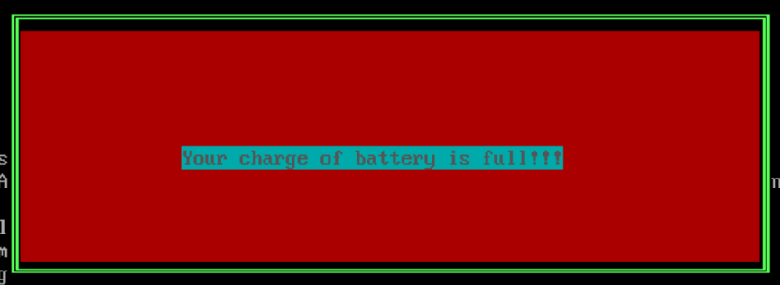

# Introductory assembler programs

All the programs are written for DOS OS.

# Ramka

The first program to train writing assembler code is `ramka.asm`. It uses videomemoty to paint the ramka.

# Radix tranlator

The second program is `radix.asm`, that get the rigister with input number and prints the number in different representations in the console.

# Keyboard interrupt

The third program is `keyboard_interrupt.asm`. If the button `S` is pressed, the following picture appears:

It also uses videomemory to draw the ramka and changes the interrupt table in DOS, that controles all buttons in keyboard. After all button actions, old handler is runned.
