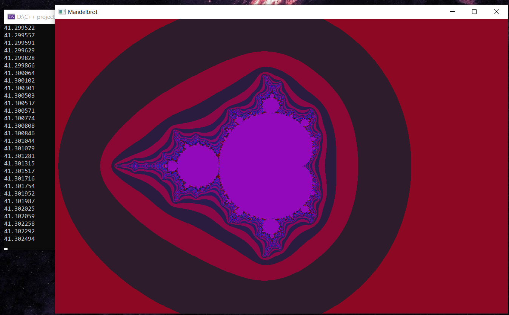

# Mandelbrot optimization

The main idea is to optimize Mandelbrot picture rendering with help of Intrinsics (SIMD instructions). In my case I should use [Intel® Intrinsics](https://software.intel.com/sites/landingpage/IntrinsicsGuide/).

The result of the program is its boost in 3,42 times (128 bits, using SSE4.1) and 4,5 times (256 bits, using AVX2).

